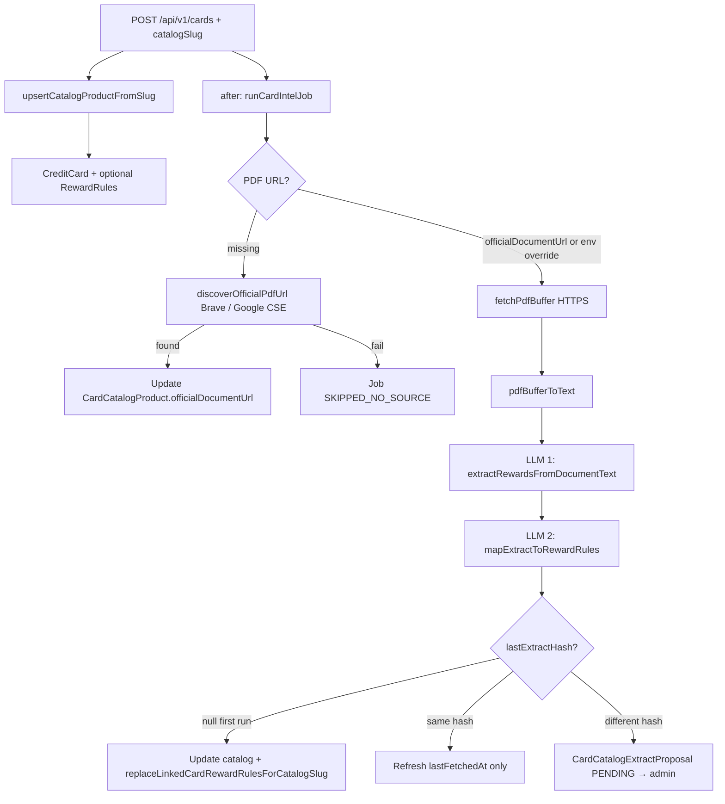

# Card catalog intelligence pipeline

How catalog-linked cards get rewards data: PDF discovery/fetch → LLM extract → Prisma updates / admin proposals.

Conceptually aligned with code under `frontend/`. Provider pricing and free tiers change often — verify official docs before budgeting.

## 1. Pipeline overview

## 2. Prisma models involved

| Model | Role |
|-------|------|
| `User` | Owns wallet cards (`CreditCard.userId`) |
| `CreditCard` | User card; optional `catalogProductSlug` |
| `RewardRule` | Category earn rates; bulk-replaced for linked cards on first successful extract |
| `CardCatalogProduct` | One row per catalog product (`slug`); stores `officialDocumentUrl`, `lastExtractHash`, `lastExtractJson` |
| `CardIntelJob` | Job trace: `PENDING` → `RUNNING` → `COMPLETED` \| `FAILED` \| `SKIPPED_NO_SOURCE` |
| `CardCatalogExtractProposal` | When a new extract hash differs from a frozen one: admin `PENDING` / `APPLIED` / `DISMISSED` |

Schema: `frontend/prisma/schema.prisma`.  
Optional reset script (use carefully): `frontend/prisma/reset-card-pipeline-data.sql`.

## 3. Code flow

### 3.1 Create card with catalog link

1. Client `POST /api/v1/cards` with `catalogSlug` matching a static catalog id.
2. `upsertCatalogProductFromSlug` upserts `CardCatalogProduct` from `CARD_CATALOG_ENTRIES`.
3. `CreditCard` is created; optional body `rules` persist as `RewardRule`.
4. If `catalogSlug` is set, Next.js `after()` runs `runCardIntelJob` asynchronously.

### 3.2 Intel job (`runCardIntelJob`)

File: `frontend/src/server/card-intelligence/run-intel-job.ts`.

1. Create `CardIntelJob` (`PENDING` → `RUNNING`).
2. Load `CardCatalogProduct` by slug.
3. Resolve PDF URL: env overrides (`CARD_INTEL_OVERRIDE_*`) or `officialDocumentUrl`; otherwise discover via Brave / Google CSE (`discover-official-pdf-url.ts`, `pdf-discovery-query.ts`) with issuer-aware scoring.
4. No PDF → `SKIPPED_NO_SOURCE`.
5. HTTPS fetch → local PDF text extract (`pdf-text.ts`).
6. LLM 1 — structured rewards JSON (`extract-rewards.ts`).
7. LLM 2 — map to internal categories / `RewardRuleDraft` (`map-extract-to-reward-rules.ts`).
8. Branch on `lastExtractHash`:
   - **null (first run):** update catalog + replace linked card rules.
   - **same hash:** refresh `lastFetchedAt` only.
   - **different hash:** create admin `CardCatalogExtractProposal`.

### 3.3 LLM providers

Central router: `frontend/src/server/card-intelligence/card-intel-llm.ts`.

- **OpenAI** — `OPENAI_API_KEY`, model `CARD_INTEL_MODEL` (default `gpt-4o-mini`)
- **Anthropic** — `ANTHROPIC_API_KEY`, model `CARD_INTEL_ANTHROPIC_MODEL`
- **`CARD_INTEL_PROVIDER`** — comma list; default tries OpenAI then Anthropic; failover on 429/quota when both keys exist
- **`CARD_INTEL_MAX_DOC_CHARS`** — truncate document text (default `120000`)

See also root / `frontend/.env.example`.

## 4. Alternative LLM providers (not wired yet)

Only OpenAI and Anthropic are implemented today. Candidates for a future client in `card-intel-llm.ts`: Google Gemini, Groq, Mistral, Together, Cohere, Azure OpenAI, AWS Bedrock, or self-hosted (Ollama / vLLM). Consumer ChatGPT / Cursor subscriptions are **not** drop-in replacements for server API keys.

## 5. Cost / reliability levers already in the repo

| Lever | Effect |
|-------|--------|
| Brave Search / Google CSE | Find official PDFs without hardcoding every URL |
| Curated `officialDocumentUrl` | Skip search when known |
| Dev PDF overrides | Test without discovery |
| Document truncation | Fewer tokens |
| Local `pdf-parse` | No OCR API cost for text PDFs |
| Dual-provider failover | Resilience on rate limits |

## 6. Possible next optimizations

1. Add Gemini (often generous free tier) behind the same JSON schema.
2. Skip LLM when PDF bytes / hash unchanged.
3. Move jobs to a real queue to avoid serverless timeouts on large PDFs.
4. Smaller model for the mapping step only.
5. Dedicated “re-run intel” admin action (partially available via catalog refresh routes).

## 7. Verifying a job

- Inspect `CardIntelJob` (`status`, `errorMessage`, `finishedAt`).
- `COMPLETED` without new rules may mean a proposal was opened instead of auto-apply.
- Admin catalog UI lists `PENDING` proposals.

## 8. Key files

| File | Role |
|------|------|
| `frontend/src/server/card-intelligence/run-intel-job.ts` | Orchestration |
| `frontend/src/server/card-intelligence/card-intel-llm.ts` | Provider routing |
| `frontend/src/server/card-intelligence/extract-rewards.ts` | Extract prompt |
| `frontend/src/server/card-intelligence/map-extract-to-reward-rules.ts` | Rules mapping |
| `frontend/src/server/card-intelligence/apply-catalog-proposal.ts` | Admin apply + linked sync |
| `frontend/src/server/card-intelligence/discover-official-pdf-url.ts` | Search discovery |
| `frontend/prisma/schema.prisma` | Models / enums |
