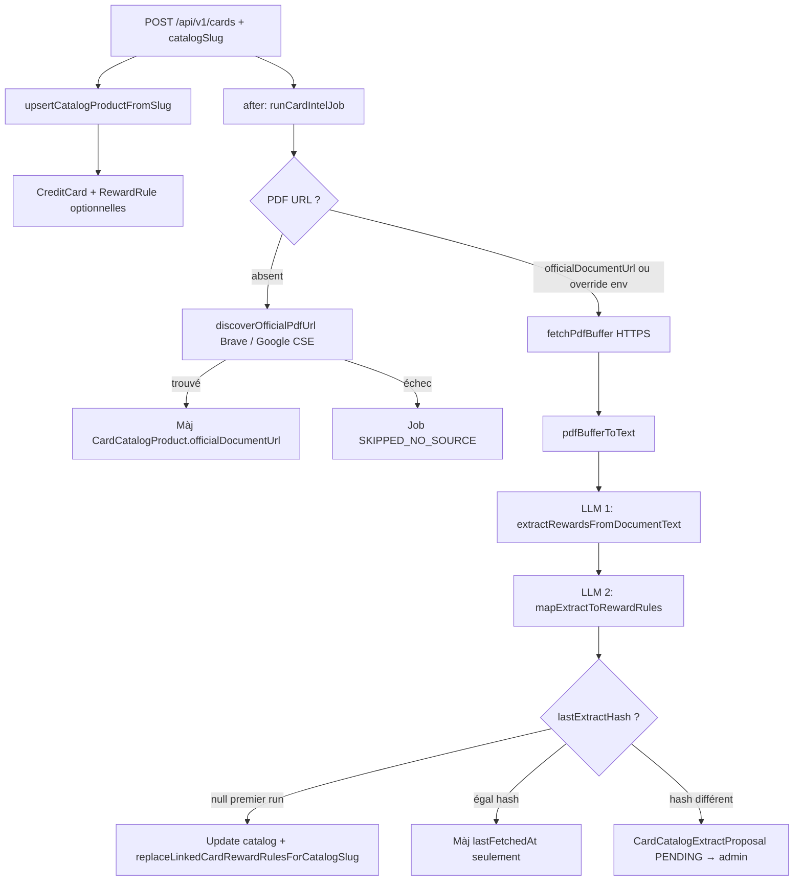

# Catalogue cartes, pipeline d’intel (PDF → LLM → base) et alternatives LLM

Ce document décrit **comment les données sont créées et mises à jour** quand un utilisateur ajoute une carte liée au catalogue, **quelles tables Prisma** sont touchées, et **quels fournisseurs / optimisations** existent pour réduire la dépendance à une seule API payante.

> **À jour conceptuellement** par rapport au code dans `frontend/`. Les **tarifs et quotas gratuits** des fournisseurs **changent souvent** : vérifie toujours les liens officiels ci-dessous avant de budgétiser.

---

## 1. Schéma mental de la pipeline

---

## 2. Tables PostgreSQL (Prisma) concernées

| Modèle | Rôle |
|--------|------|
| `User` | Propriétaire des cartes (`CreditCard.userId`). |
| `CreditCard` | Carte utilisateur ; `catalogProductSlug` relie au catalogue si renseigné. |
| `RewardRule` | Règles de gains par catégorie ; **remplacées en masse** pour toutes les cartes liées au même `catalogProductSlug` lors du **premier** extract réussi (voir ci-dessous). |
| `CardCatalogProduct` | Une ligne par produit catalogue (`slug` = id du catalogue statique). Stocke `officialDocumentUrl`, `lastExtractHash`, `lastExtractJson`, `lastFetchedAt`. |
| `CardIntelJob` | Trace d’exécution async : `PENDING` → `RUNNING` → `COMPLETED` \| `FAILED` \| `SKIPPED_NO_SOURCE`. |
| `CardCatalogExtractProposal` | Quand un nouveau PDF produit un **hash différent** d’un extract déjà figé : proposition `PENDING` pour validation admin (`APPLIED` / `DISMISSED`). |

Schéma source : `frontend/prisma/schema.prisma`.

Migrations historiques : `frontend/prisma/migrations/`.  
Script SQL d’exemple pour réinitialiser les données pipeline (à utiliser avec prudence) : `frontend/prisma/reset-card-pipeline-data.sql`.

---

## 3. Flux détaillé côté code

### 3.1 Création de carte avec catalogue

1. **Client** envoie `POST /api/v1/cards` avec un corps incluant `catalogSlug` (doit correspondre à un id du catalogue statique).
2. **`upsertCatalogProductFromSlug`** (`frontend/src/server/catalog-db-sync.ts`) lit `CARD_CATALOG_ENTRIES` (`frontend/src/server/card-catalog.entries.ts`) et **upsert** `CardCatalogProduct`.
3. **`CreditCard`** est créée avec `catalogProductSlug` ; les `rules` du body optionnel sont persistées en `RewardRule`.
4. Si `catalogSlug` est présent, **`after()`** (Next.js) lance **`runCardIntelJob`** de façon asynchrone (`frontend/src/app/api/v1/cards/route.ts`).

### 3.2 Job d’intel (`runCardIntelJob`)

Fichier : `frontend/src/server/card-intelligence/run-intel-job.ts`.

1. Création `CardIntelJob` (`PENDING` → `RUNNING`).
2. Chargement `CardCatalogProduct` par `productSlug`.
3. **URL du PDF** : `CARD_INTEL_OVERRIDE_SLUG` + `CARD_INTEL_OVERRIDE_PDF_URL` (dev / secours) sinon `officialDocumentUrl`. Si vide, **découverte** via `discoverOfficialPdfUrl` (`discover-official-pdf-url.ts` + `pdf-discovery-query.ts`) : requête avec **phrase exacte** (nom catalogue entre guillemets), **termes `-exclus`** dérivés des slugs « sœurs » même émetteur (ex. `discover-it` exclut `miles` venant de `discover-it-miles`), puis **choix du meilleur** candidat parmi les résultats (score URL + titre/snippet, pas seulement le premier lien) :
   - **Brave Search** si `BRAVE_SEARCH_API_KEY` (ou `BRAVE_API_KEY`) — [tableau de bord Brave](https://api-dashboard.search.brave.com/) ;
   - sinon **Google Custom Search** si `GOOGLE_API_KEY` + `GOOGLE_CSE_ID`.
4. Si aucun PDF : statut **`SKIPPED_NO_SOURCE`** avec message d’aide (domaines émetteur, clés API, etc.).
5. **Téléchargement** HTTPS (`fetch-document.ts`), **extraction texte** PDF (`pdf-text.ts` — charge `pdf-parse/lib/pdf-parse.js` pour éviter le bug `05-versions-space.pdf`).
6. **LLM 1** — `extract-rewards.ts` : JSON structuré (`rewardsExtractSchema`).
7. **LLM 2** — `map-extract-to-reward-rules.ts` : mapping vers catégories internes + `RewardRuleDraft`.
8. **Branche selon `lastExtractHash`** sur le produit catalogue :
   - **Premier extract** (`lastExtractHash` null) : mise à jour catalogue + **`replaceLinkedCardRewardRulesForCatalogSlug`** (`apply-catalog-proposal.ts`) → toutes les cartes avec ce `catalogProductSlug` reçoivent les nouvelles règles.
   - **Même hash** : refresh `lastFetchedAt` seulement.
   - **Hash différent** : création **`CardCatalogExtractProposal`** (`PENDING`) ; l’admin peut appliquer (`applyCatalogExtractProposal` dans le même fichier + routes API admin).

### 3.3 Fournisseurs LLM actuellement branchés

Fichier central : `frontend/src/server/card-intelligence/card-intel-llm.ts`.

- **OpenAI** : `OPENAI_API_KEY`, modèle `CARD_INTEL_MODEL` (défaut **`gpt-4o-mini`**).
- **Anthropic** : `ANTHROPIC_API_KEY`, modèle `CARD_INTEL_ANTHROPIC_MODEL` (défaut **`claude-3-5-haiku-20241022`**).
- **`CARD_INTEL_PROVIDER`** : liste séparée par virgules, ex. `anthropic` ou `openai,anthropic`. Si **les deux clés** sont définies sans variable explicite, l’ordre par défaut est **`openai` puis `anthropic`** ; en cas de **429 / quota / rate limit** sur le premier, bascule vers le suivant.
- **`CARD_INTEL_MAX_DOC_CHARS`** : tronque le texte envoyé au LLM (défaut 120000) pour limiter coût et timeouts.

Variables résumées aussi dans `.env.example` à la racine du repo.

### 3.4 Score « wallet » (heuristique multi-signaux)

Le tri / affichage des cartes utilise un **score additif** (pas un embedding) calculé dans `frontend/src/lib/wallet-score.ts` et exposé via `map-credit-card.ts` :

1. **Crédits / avantages PDF** (`statementCredits` dans `lastExtractJson`) : bonus par ligne + contribution liée aux **montants en `$`** parsés dans le texte (ex. crédit Uber 200 $ augmente le score).
2. **Structure d’earn PDF** (`earnRates`) : bonus selon **multiplicateurs / %** détectés dans le texte, avec un léger poids si le libellé évoque groceries, dining, travel, etc.
3. **Règles persistées** (`RewardRule` sur la carte) : somme pondérée par **catégorie** (grocery / dining / travel comptent plus que `OTHER`) et léger bonus pour le cashback %.

Le total et les trois composantes sont renvoyés dans l’API (`walletScore`, `walletPreview.scoreBreakdown`).

---

## 4. Alternatives à OpenAI (et à Anthropic) — panorama

Toutes ces options supposent **d’intégrer un nouveau client SDK ou REST** dans `card-intel-llm.ts` (ou équivalent). Aujourd’hui seuls **OpenAI** et **Anthropic** sont implémentés.

| Fournisseur | Intérêt typique | Gratuit / essai | Tarifs (source officielle) |
|-------------|-----------------|------------------|----------------------------|
| **OpenAI** | Qualité / JSON mode ; déjà utilisé. | Pas de « gratuit illimité » : compte API + **crédits / facturation** en général. | [openai.com/api/pricing](https://openai.com/api/pricing/) |
| **Anthropic (Claude)** | Très bon pour extraction structurée. | Crédits d’essai possibles sur la console (politique variable). | [docs.anthropic.com — Pricing](https://docs.anthropic.com/en/docs/about-claude/pricing) |
| **Google Gemini** | Souvent un **palier gratuit** généreux pour prototyper ; bon pour JSON si prompt clair. | Quotas par minute / jour selon le palier (voir doc). | [ai.google.dev — Pricing](https://ai.google.dev/gemini-api/docs/pricing) et [Rate limits](https://ai.google.dev/gemini-api/docs/rate-limits) |
| **Groq** | Latence très faible, modèles open (Llama, etc.). | Palier gratuit limité (RPM / jour — vérifier le site). | [groq.com — Pricing](https://groq.com/pricing) |
| **Mistral AI** | API européenne, modèles compétitifs. | Offres / crédits selon période. | [mistral.ai — Pricing](https://mistral.ai/pricing) |
| **Together AI** | Hébergement de modèles open. | Crédits promo possibles. | [together.ai — Pricing](https://www.together.ai/pricing) |
| **Cohere** | Classification / RAG parfois moins cher. | Free tier historique, à vérifier. | [cohere.com — Pricing](https://cohere.com/pricing) |
| **Azure OpenAI** | Même famille de modèles OpenAI, facturation Azure. | Pas de gratuit Azure générique ; crédits Azure nouveaux comptes parfois. | [azure.microsoft.com — OpenAI](https://azure.microsoft.com/products/ai-services/openai-service) |
| **AWS Bedrock** | Accès multi-modèles (Claude, Llama, etc.) via AWS. | Quotas liés au compte AWS. | [aws.amazon.com — Bedrock pricing](https://aws.amazon.com/bedrock/pricing/) |
| **Ollama / vLLM (self-host)** | Coût marginal une fois la machine payée ; pas d’API cloud. | « Gratuit » hors infra ; qualité JSON moindre sans modèle adapté. | N/A (local) |

**Cursor, ChatGPT Plus, etc.** : ce sont d’autres produits ; **ils ne remplacent pas** les clés API pour ton serveur SpendLess (voir discussions précédentes).

---

## 5. Optimisations « gratuites » ou peu coûteuses **déjà dans le projet**

| Levier | Où | Effet |
|--------|-----|--------|
| **Brave Search API** | `discover-official-pdf-url.ts` | Plan gratuit limité (ordre de grandeur **~2k requêtes/mois** selon Brave) pour trouver un PDF officiel sans payer Google CSE. |
| **Google CSE** | Même fichier | 100 requêtes/jour **gratuites** sur le programme Custom Search standard (au-delà : payant). |
| **`officialDocumentUrl` dans le catalogue** | `card-catalog.entries.ts` + DB | Évite les recherches payantes / fragiles : PDF connu dès le départ. |
| **Overrides dev** | `CARD_INTEL_OVERRIDE_SLUG` + `CARD_INTEL_OVERRIDE_PDF_URL` | Tester sans search ni prod. |
| **Troncature document** | `CARD_INTEL_MAX_DOC_CHARS` | Moins de tokens LLM → moins cher et plus rapide. |
| **`pdf-parse` local** | `pdf-text.ts` | Pas de coût API pour l’OCR texte (hors CPU). |
| **Bascule Anthropic sur 429 OpenAI** | `card-intel-llm.ts` | Résilience si les deux clés sont configurées. |

---

## 6. Idées d’optimisation **non implémentées** (évolution possible)

1. **Brancher Gemini** (souvent bon palier gratuit) dans `card-intel-llm.ts` avec `GEMINI_API_KEY` et le même schéma JSON.
2. **Cache d’embeddings / hash PDF** : si l’URL PDF + hash fichier inchangé, sauter LLM 1 ou les deux étapes (stockage intermédiaire).
3. **Batch / async queue** : découpler complètement le job de la requête HTTP (queue Redis, Supabase Edge Function + cron) pour éviter timeouts Vercel sur gros PDF.
4. **Modèle unique plus petit** pour l’étape 2 (mapping) si l’étape 1 est déjà riche.
5. **Admin : bouton « Relancer l’intel »** sur une carte : aujourd’hui il faut recréer une carte ou déclencher manuellement un job (pas d’endpoint dédié dans le dépôt au moment de la rédaction).

---

## 7. Vérifier qu’un job a bien tourné

- Table **`CardIntelJob`** : `status`, `errorMessage`, `finishedAt`.
- Si `COMPLETED` mais pas de règles : vérifier si `lastExtractHash` était déjà défini (proposition admin au lieu d’écriture auto).
- Admin catalogue : propositions `CardCatalogExtractProposal` en `PENDING`.

---

## 8. Références fichiers clés

| Fichier | Rôle |
|---------|------|
| `frontend/src/lib/wallet-score.ts` | Heuristique du score wallet (PDF + règles). |
| `frontend/src/lib/map-credit-card.ts` | JSON carte + `walletScore` / `walletPreview`. |
| `frontend/src/app/api/v1/admin/credit-cards/route.ts` | Liste admin toutes les cartes. |
| `frontend/src/app/admin/credit-cards/page.tsx` | Tableau admin cartes. |
| `frontend/src/app/api/v1/cards/route.ts` | POST carte + `after(runCardIntelJob)`. |
| `frontend/src/server/card-intelligence/run-intel-job.ts` | Orchestration pipeline. |
| `frontend/src/server/card-intelligence/card-intel-llm.ts` | Routage OpenAI / Anthropic. |
| `frontend/src/server/card-intelligence/extract-rewards.ts` | Prompt extraction. |
| `frontend/src/server/card-intelligence/map-extract-to-reward-rules.ts` | Prompt mapping règles. |
| `frontend/src/server/card-intelligence/apply-catalog-proposal.ts` | Application admin + sync règles liées. |
| `frontend/src/server/card-intelligence/pdf-discovery-query.ts` | Requête web + score de pertinence PDF. |
| `frontend/src/server/card-intelligence/discover-official-pdf-url.ts` | Brave / Google. |
| `frontend/src/server/card-intelligence/issuer-official-domains.ts` | Domaines émetteurs pour la recherche. |
| `frontend/prisma/schema.prisma` | Modèles et enums. |

---

*Document généré pour SpendLess ; adapter les sections tarifaires dès que les fournisseurs publient une nouvelle grille.*
